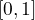
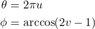
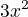

# Table of Contents

1.  [Setting up the Simulation](#orgbd37c64)
    1.  [Random Distribution of Points on a sphere](#org8c5137c)
    2.  [Evenly Distribution by Fibonacci Sphere Algorithm](#org49c150b)
    3.  [Spacecraft coordinates](#org59de673)
2.  [The Coordinate Systems](#org043f479)
    1.  [ICRS](#org6b075de)
    2.  [GBM](#orgb01518e)

# Setting up the Simulation

## Random Distribution of Points on a sphere

Choose  and  from uniform distribution in 
To obtain the angles use formulas:

1

Source: [MathWorld](http://mathworld.wolfram.com/SpherePointPicking.html)

## Evenly Distribution by Fibonacci Sphere Algorithm

[StackOverflow Source](https://stackoverflow.com/questions/9600801/evenly-distributing-n-points-on-a-sphere)

[Modified Fibonacci Source](http://extremelearning.com.au/evenly-distributing-points-on-a-sphere/) (Modified Fibonacci Broken)

## Spacecraft coordinates

From Trigdata we can get

    RA_SCX  =             198.1504 / [deg] Pointing of spacecraft x-axis: RA        
    DEC_SCX =               2.8766 / [deg] Pointing of spacecraft x-axis: Dec       
    RA_SCZ  =             279.3483 / [deg] Pointing of spacecraft z-axis: RA        
    DEC_SCZ =             -71.8215 / [deg] Pointing of spacecraft z-axis: Dec  

[SkyCoord Introduction of Spacecraft Coordinates](file:///home/niklas/venv/lib/python2.7/site-packages/gbmgeometry-0.1.2-py2.7.egg/gbmgeometry/gbm.py)
Usage of icrs coordinate system

[J2000 and GBM transformation](file:///home/niklas/venv/lib/python2.7/site-packages/gbmgeometry-0.1.2-py2.7.egg/gbmgeometry/gbm_frame.py)

# The Coordinate Systems

## ICRS

## GBM

We need quaternions and spacecraft position from trigdat

